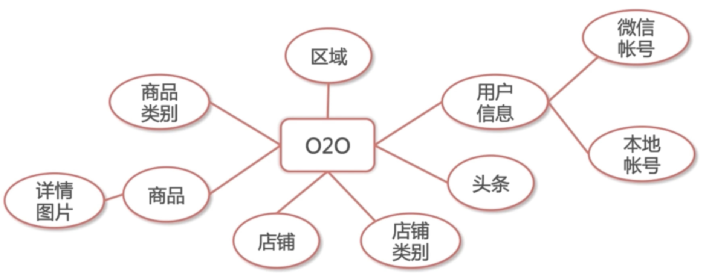

# 校园商铺系统SSM

## 系统模块的划分

### 实体类解析

实体类设计

区域：

用户信息：id  姓名 头像 邮箱 性别 状态 身份标示 创建时间 修改时间

微信： ID 创建时间 openID 用户ID 

本地账号：ID 用户名 密码 创建时间 用户ID

头条：ID 权重 状态 链接 名称 图片 创建时间 修改时间

店铺类别： ID 权重 上级ID 描述 图片 创建时间 修改时间

店铺 ：ID 权重 门面 店面照 描述 地址 联系方式 区域ID 类别ID 用户ID 状态 创建时间 修改时间 建议

### 问题参考链接

[Tomcat 配置过程]( https://blog.csdn.net/GouGe_CSDN/article/details/105477849)

[Mysql8.0+配置遇到的问题](https://blog.csdn.net/qq_41464283/article/details/105661884?utm_medium=distribute.pc_relevant.none-task-blog-BlogCommendFromMachineLearnPai2-3.channel_param&depth_1-utm_source=distribute.pc_relevant.none-task-blog-BlogCommendFromMachineLearnPai2-3.channel_param)

## SSM配置过程

* 在pom中指定依赖jar包

* 在jdbc.properties中指定数据的连接方式
* 创建mybatis-config.xml对mybatis配置
* 创建spring-dao.xml将jdbc.properties和mybatis加载进来，创建data source连接池，配置好mybatis和数据库交互的方式
* 创建spring-service.xml用于事务管理，将spring-dao中的dataSource注入到事务管理器中
* 创建spring-web.xml定义dispatcherServlet如何响应URL请求,也就是controller的一些行为
* 将spring.servlet注册到文件中响应前端请求，并且将以上三个spring文件都注册进来

##### [mybatis](https://blog.csdn.net/ThinkWon/article/details/101292950)

mybatis可以直接用SQL语句而不需要其他的格式辅助

mapper标签下定义namespace属性，标记方法

##### 用到的标签

@Service @Autowired @Controller(作用和@service一样) @RequestMapping路由 @RequestMapping

Junit @Runwith @ContextConfiguration @Test

## SSM 知识点

SpringMVC: DispatcherServlet

Spring: IOC 和 AOP

MyBatis: ORM

## Logback日志配置

* logback-access 第三方软件可以通过这个访问到日志

* Logback-classic 
* Logback-call

主要标签

* logger 存日志对象
* appender指定输出媒介
* layout格式化日志输出

## 项目1.0开发

### 店家管理系统

模块：店铺，商品

#### 店铺注册

学习目标：连接数据库，mybatis配置, Dao-service-controller

配置数据库需要考虑的因素：driver, 服务地址，用户名，密码，连接池最大线程数

